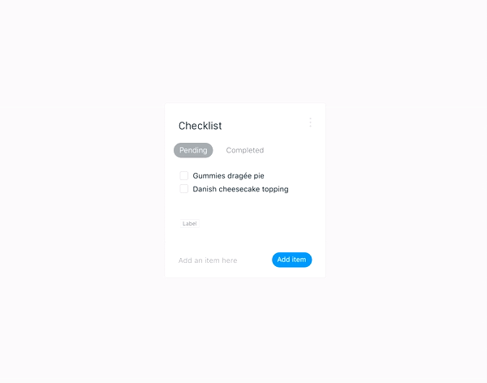

# Vue.js test

## What is the task?
In order to show your skills and how fast you can learn you'll need to create a "todo" app.

When you'll start the app you'll skeleton of the app with tasks in it.

**Complete as many tasks as you can** however you don't have to do all of them.

Here's a sample video of a UX:


The closer it will look to this video, the better.

## How to submit a task?
### Using github
1. create a [fork](https://help.github.com/articles/fork-a-repo/) of this repository in a github.
1. complete tasks by changing source code of a project in your fork.
1. create a [pull request](https://help.github.com/articles/creating-a-pull-request/) on a github with your changes.

### In case you don't have github account (really?)
1. download sources of a repository
1. complete tasks by changing source code of a project in your local copy.
1. email modified source as a zip, but avoid adding `node_modules` into archive to reduce its size.

## Where to start?
Before you start coding you should understand main concept of `vue.js` especially its _reactivity_.

If you're not familiar with vue.js 2.0 **start by reading this [guide](https://vuejs.org/v2/guide/)**.

More detailed documentation can be found in [API](https://vuejs.org/v2/api/) section.

Also in order to complete tasks you'll need to get familiar with [keen-ui](https://josephuspaye.github.io/Keen-UI/) vue components.

## What you should do?
We encourage  you to:
 - use [ES6 features](http://es6-features.org/#Constants) in your JavaScript code
 - use [SASS](http://sass-lang.com/documentation/file.SASS_REFERENCE.html) (SCSS) instead of CSS
 - use [CSS flexbox](https://css-tricks.com/snippets/css/a-guide-to-flexbox/)

## What you should not do?
 - spend time setting up development environment
 - change build process of the app
 - add vendor prefixes to your CSS
 - in most cases you don't need to change files like `*.js`, focus on `*.vue` files

## What matters most?
Your implementation will be judged based on:
 - understanding of vue.js concepts
 - code structure and readability
 - CSS/SASS markup approach
 - amount of complete tasks

## How to run the app?
### Install node.js
First of all you should install [node.js](https://nodejs.org/en/).

**IMPORTANT!** Make sure that version of `node.js` is at least 4 and version of `npm` is at least 3.0.0

#### macOS
In case you're using macOS we suggest you to install it with [homebrew](https://brew.sh):
``` bash
brew install node
```

### Install dependencies
After that you need to run next commands in a directory with a project:
``` bash
# install dependencies
npm install
```

### Start the app
And finally to to start dev server run this in a directory with the app:
``` bash
# serve with hot reload at localhost:8080
npm run dev
```

Main file for you to work with will be `src/components/todo.vue`.

In most cases when you'll change source code browser with refresh automatically, but sometimes in order to see changes you'll need to refresh it manually or even restart dev server.

**IMPORTANT!** if you don't see the app running after completing all steps above up environment contact us so we can help you.

## FAQ
### Can I do tasks not in the order?
Yes, you may do tasks in any order you want.

### Can I use other npm packages?
Yes, you can use any packages you need, just don't forget to add them to `package.json` as a dependencies.

In case you need to add `jquery` to complete this task, you should read vue.js guides again (;

### Can I use SASS?
Yes, it's highly appreciated!

### Can I use LESS?
We suggest you to use SASS instead of LESS.

You can use it, but you'll need to configure build process to process less properly

### What editor should I use?
You can use any editor you like.
In case you don't have one, you can use [atom](https://atom.io) with [vue.js plugin](https://atom.io/packages/language-vue)

### How to debug vue.js application?
Debugging reactive application can be very tricky, so to help it we suggest to use Google Chrome with [vue-devtools](https://chrome.google.com/webstore/detail/vuejs-devtools/nhdogjmejiglipccpnnnanhbledajbpd?hl=en)

### Can I change a look of `keen-ui` components?
Yes, if default appearance does not work for you feel free to overwrite it with your styles.

### Can I create my own components based on `keen-ui` ones?
Yes, if it makes sense you should do it!

### What if I already have node.js but its version is less than needed?
You can use [nvm](https://github.com/creationix/nvm/blob/master/README.markdown) to have maintain multiple versions of node.js.

In case of macOS it can be installed via homebrew

### What should I do if I don't see changes I made?
Make sure that dev server is still running.

Sometimes you'll need to refresh browser manually or even restart dev server to see your changes.

### I've started dev server but it said that npm version is wrong, after updating npm it say about missing packages.
If may happen when you started installing the app with older version of `npm`, then upgraded `npm` and trying to run or reinstall packages.

To deal with this first delete `node_modules` directory:
``` bash
rm -rf node_modules
```
then install packages once again
``` bash
npm install
```
